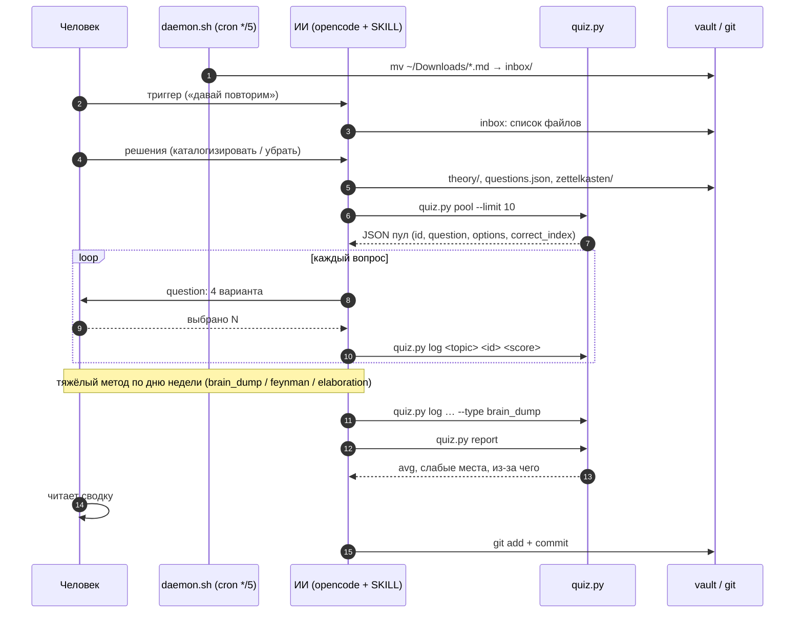
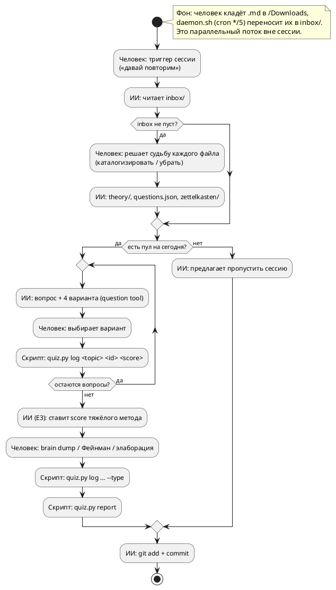
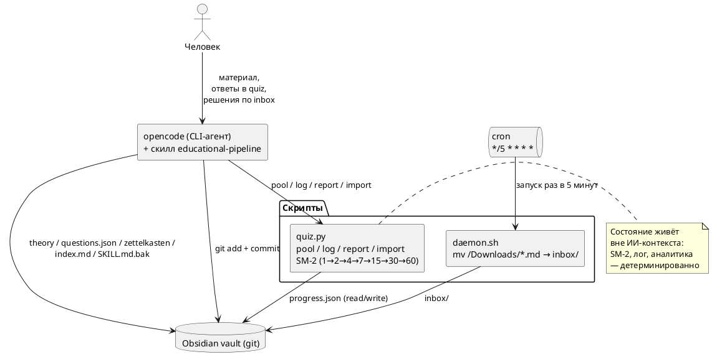

# Отчёт об использовании ИИ-инструментов

> Задание: отчёт об использовании ИИ-инструментов при выполнении `AI_02_using`.
> Файлы-исходники: `PROMPT.md` (цель), `educational-pipeline-plan.md` (план),
> `00_chat-log.md` + `01_chat-log.md` (логи чата).

## 1. Цель использования

см. `PROMPT.md`

## 2. Формат работы

Работа оформлена как **отчёт + код**: текстовый отчёт (этот файл) плюс
созданные артефакты — скрипты, демон и ИИ-скилл. Артефакты приложены в
папку `artifacts/` (копии; md5 сверен с оригиналами в vault и `~/.agents/skills/`).

| Артефакт | Путь (исходник) | Путь (приложен) | Роль |
|---|---|---|---|
| `quiz.py` (Python 3.14) | `obsidian/pipeline/quiz.py` | `artifacts/quiz.py` | ядро: `pool / log / report / import`, SM-2, лог, аналитика |
| `daemon.sh` (bash) | `obsidian/pipeline/daemon.sh` | `artifacts/daemon.sh` | сборщик `.md` из `~/Downloads` → `inbox/` (через cron) |
| `SKILL.md` (ИИ-скилл) | `~/.agents/skills/educational-pipeline/SKILL.md` | `artifacts/SKILL.md` | сценарий сессии агента (триггеры, inbox, quiz, тяжёлый метод, сводка, git, бэкап) |
| `templates/*` | `obsidian/pipeline/templates/` | `artifacts/templates/` | шаблоны: `theory.md`, `questions.json`, `zettelkasten.md` |
| `README.md` | `obsidian/pipeline/README.md` | `artifacts/README.md` | короткий CLI-справочник `quiz.py` и демона |

Структура приложенных файлов:

```
artifacts/
├── quiz.py                 # Python: pool/log/report/import + SM-2 + аналитика
├── daemon.sh               # bash: mv ~/Downloads/*.md → inbox/ (cron */5)
├── SKILL.md                # сценарий ИИ-агента educational-pipeline
├── README.md               # справка по CLI quiz.py и демону
└── templates/
    ├── theory.md.template
    ├── questions.json.template
    └── zettelkasten.md.template
```

**Происхождение кода:** сгенерирован ИИ (Qwen3.8 в агентной среде opencode) внутри
диалога с пользователем по `PROMPT.md` + плану, затем пользователь зафиксировал решения
(см. раздел 5) и ИИ реализовал их. Артефакты — итог совместной работы, не «готовая
генерация».

> Примечание: артефакты в `artifacts/` — **копии** для приложения к отчётности;
> рабочие оригиналы живут в `obsidian/pipeline/` и `~/.agents/skills/` (см. раздел 3).

## 3. Использованные инструменты

**Модели (LLM)** — расклад из `AI_02_tools_choice_edited.md`:

| Роль | Инструмент |
|---|---|
| Планирование / разбор задач | Alice AI, GigaChat |
| Реализация кода | Qwen3.8 |

**Агентная среда / runtime:**

- **opencode** — CLI-агент: читает/пишет файлы, запускает `quiz.py`, ведёт quiz,
  делает `git add/commit`, управляет демоном.
- **ИИ-скилл `educational-pipeline`** (`~/.agents/skills/educational-pipeline/SKILL.md`)
  — закреплённый сценарий сессии (триггеры → inbox → quiz → тяжёлый метод → сводка → git).

**Инструменты opencode, использованные в работе:**

- `question` — интерактивные вопросы с выбором (вместо текстового списка);
- `bash` — запуск `quiz.py`, `daemon.sh`, git-команды, установка cron;
- file read/write + glob/grep — сборка vault, правка плана и SKILL.md;
- `task` — фоновые/параллельные проверки.

**Базовые утилиты окружения:**

- **Python 3.14.4** — `obsidian/pipeline/quiz.py` (команды `pool`, `log`, `report`, `import`);
- **bash** — `obsidian/pipeline/daemon.sh` (перенос `~/Downloads/*.md` → `inbox/`);
- **cron** — `*/5 * * * *` демон-сборщик (лог `~/.local/state/edu-daemon.log`);
- **jq 1.8.1** — проверка JSON-схем (`progress.json`, `questions.json`);
- **git** — коммиты в vault `obsidian/`.

**Хранилище:** Obsidian vault (`~/Documents/git/obsidian`).

## 4. Использованные промпты

см. приложенные файлы:
- `PROMPT.md` (исходный промт)
- `00_chat-log.md`, `01_chat-log.md` (пошаговый диалог с фиксацией решений A–I).

## 5. Изменения, которые я внёс в результаты работы ИИ-инструментов

ИИ предложил черновики решений по группам A–I; я зафиксировал финальную версию (перевешивает
противоречащие формулировки плана): идентификатор курса — только латиница, совпадающий с
git-папкой; при дубликате темы — новый файл, без правки существующего; вопросы — чистый
`questions.json` (а не JSON-блок в `.md`); единый `score: 0.0–1.0` вместо `bool`; порог
слабого места — средняя score < 0.7 по последним 5 ответам; лимит пула — 10 вопросов/день;
инбокс — `mv` + cron вместо копирования; zettelkasten — первое время делю секции
вместе с ИИ, чтобы нащупать границы атомарности. В итерациях поверх плана добавил секцию «Формат вопроса» в SKILL.md
(вопрос + 4 варианта через `question`-инструмент opencode, не текстом), установил cron-демон
и зафиксировал бэкап `SKILL.md` в vault с проверкой md5.

### 5.1 Какие роли выполняет автоматизация

Разделение труда: человек отвечает за вход и решения, ИИ — семантику и сессию, скрипты —
достоверное состояние и время. Скрипты `quiz.py` + `daemon.sh` (запуск через cron) — это
детерминированный слой: они не «забывают» состояние между запусками, поэтому SM-2-счётчики,
логи и расписание живут вне контекста ИИ.

| Что делает | Кто |
|---|---|
| Даёт материал (лекции, статьи, заметки) | человек |
| Решает судьбу файлов из `inbox/` (каталогизировать / убрать) | человек |
| Отвечает на quiz, ведёт brain dump / Фейнман / элаборацию | человек |
| Финальная оценка тяжёлых методов (score) | ИИ |
| Структурирует теорию, генерирует вопросы, ведёт quiz-сессию, пишет сводку | ИИ (скилл `educational-pipeline` в opencode) |
| `quiz.py`: пул по SM-2, лог ответов, report, import | скрипт |
| `daemon.sh`: перенос `~/Downloads/*.md` → `obsidian/inbox/` | скрипт (cron `*/5`) |
| Git-коммит в vault (формат сообщения определён заранее) | ИИ |

### 5.2 Визуализация

**Компоненты / последовательность** (mermaid):

```mermaid
flowchart LR
    subgraph HUMAN[Человек]
        U[материал / ответы в quiz]
    end
    subgraph AI[ИИ-агент: opencode + скилл educational-pipeline]
        S[сессия: inbox → quiz → тяжёлый метод → сводка → git]
    end
    subgraph SCRIPT[Скрипты / cron]
        D[daemon.sh<br/>~/Downloads → inbox<br/>(cron */5)]
        Q[quiz.py<br/>pool / log / report / import<br/>SM-2]
    end
    subgraph VAULT[Obsidian vault / git]
        I[inbox/]
        T[theory/ + questions.json + progress.json]
        Z[zettelkasten/]
        I2[index.md · edu-pipeline.SKILL.md.bak]
    end
    U -->|md-файл| D
    D -->|mv .md| I
    U -->|триггер-фраза| S
    I -->|опрос по каждому файлу| S
    S -->|pool| Q
    U <-->|question: 4 варианта| S
    S -->|log score| Q
    S -->|theory / questions / zettel| T
    S -->|zettel| Z
    S -->|commit| I2
    S -->|commit| T
    Q -->|read/write| T
```

**Последовательность одной сессии** (mermaid sequence):



**BPMN-процесс** (plantuml):



**Компоненты системы** (plantuml):



## 6. Мои шаги для верификации полученных данных

1. **Полный цикл SM-2** (до «живого» прогона): прогнал
   `import → pool → log (0.0 / 1.0 / brain_dump) → report` — интервалы выросли/
   сбросились корректно (см. `00_chat-log.md`, шаг «Фаза A — Тест»).
2. **Сверка md5 бэкапа** SKILL.md с оригиналом после каждого изменения
   (шаги «Фаза B» и «5.1 Формат»).
3. **Тест cron:** положил `_edu_daemon_test.md` в `~/Downloads`, подтвердил
   перенос в `inbox/` и запись в `~/.local/state/edu-daemon.log`.
4. **Живая сессия (Фаза C):** каталогизирован inbox (3 файла → `itmo_OS/proxmox-ve`,
   `LLM/opencode-ollama`, один оставлен), quiz **7 вопросов (6/7, 86%)**,
   тяжёлый метод *Brain dump* (score 0.5), сводка `report` — avg 81%,
   слабое место `proxmox-ve-005` (SSH).
5. **Проверка на диске** структуры vault:
   `obsidian/Навыки/Обучение/itmo_OS/{index.md, theory/proxmox-ve.*, zettelkasten/*.md}`,
   `pipeline/{quiz.py, daemon.sh, templates/}`, `inbox/`.
6. **Проверка конфигурации:** `quiz.py` экспортирует ровно `pool|log|report|import`;
   cron содержит строку `daemon.sh`; SKILL.md содержит нужные триггеры.
7. **Проверка git-логи** vault (`git log`): коммиты `1fc9b22`, `ae19a3c`, `f2268ac`.
8. **Требование проверить «работу» скилла** (не текст), а не только наличие файлов
   (`00_chat-log.md`, шаги 116–131).

## 7. Рефлексия

_(заполняется человеком)_
