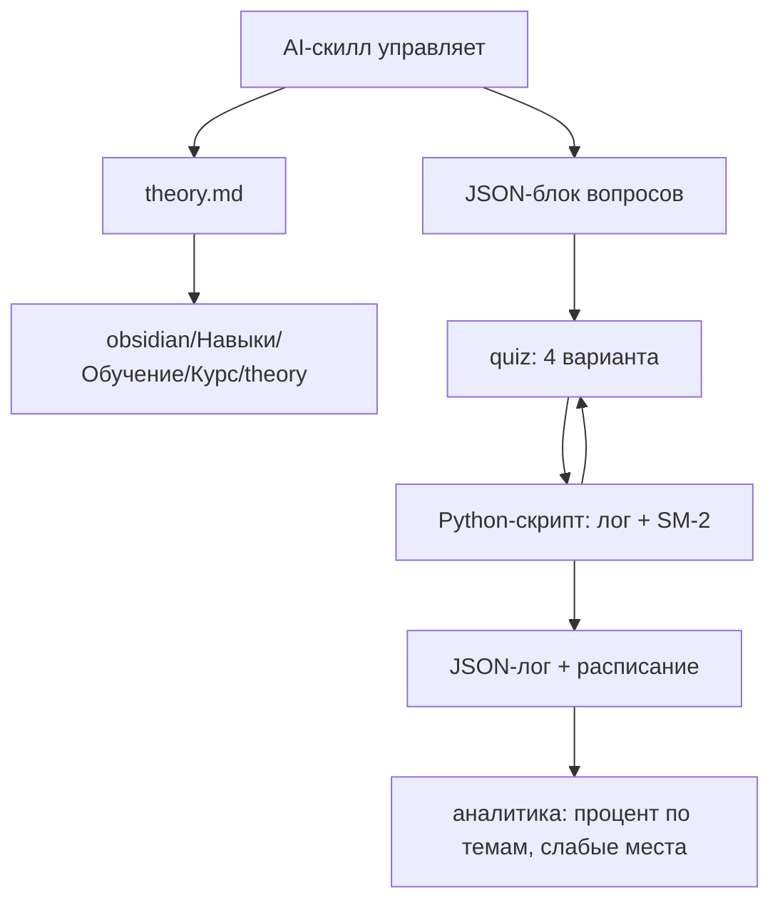
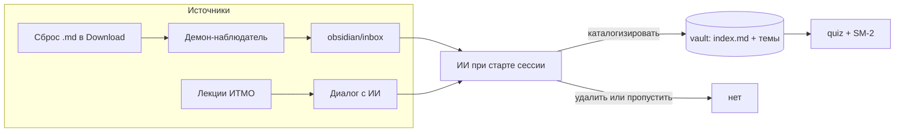
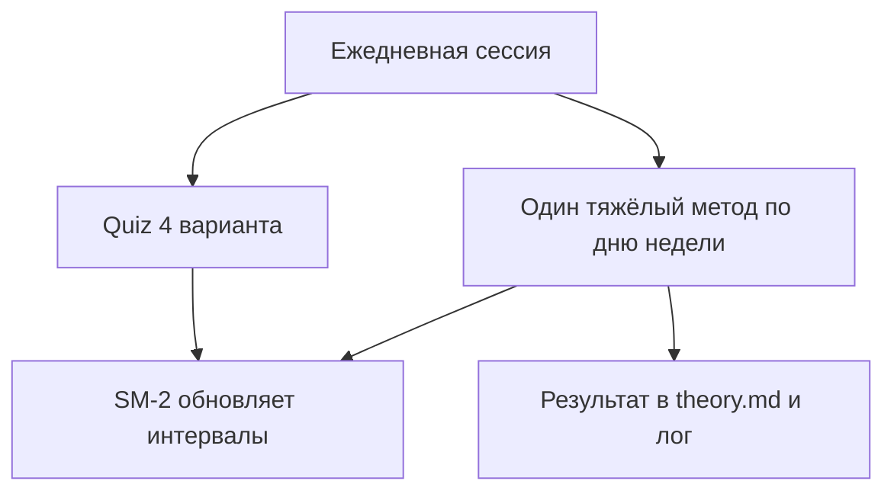

# Educational Pipeline — Final Plan

## Context

Студент изучает навыки по курсам ИТМО и хочет не просто сдавать задания, а
глубоко усваивать теорию: сохранять её в Obsidian и регулярно повторять через
quiz с расписанием по методу интервальных повторений.

> **Важно:** предшествующий `plan.md` описывал несуществующую структуру
> (`Vault/`, `config/`, `scripts/`, курсы вида `config/data/scripts/tests/work`).
> Этот план переписан под **фактическую** структуру репозиториев.

## Фактическая структура (проверено)

- **`obsidian/`** — vault Obsidian. Плоский, заметки по темам, русские имена,
  теги через `#тег` в конце файла. Есть секции `Навыки/Обучение/` (уже про
  обучение), `Навыки/Программирование/`, `Государство/`.
- **`itmo/`** — домашние работы: `android_projects/` + `ITMO/` с 5 курсами
  магистратуры (`itmo_base_python`, `itmo_GO`, `itmo_OS`, `itmo_security`,
  `itmo_base_algorithm`). Каждый курс — практический код-репозиторий (README,
  .py файлы), **теории там нет**.

## Согласованные решения

| Решение | Выбор |
| --------- | ------- |
| Формат теории | Гибрид: минимальный frontmatter + обычный текст + `#теги` |
| Деление теории | Гибрид: `index.md` курс как оглавление + отдельные файлы на темы |
| Генерация вопросов | AI в сессии → JSON-блок в файле вопросов; quiz читает и логирует |
| Хранилище истории | JSON, `progress.json` на каждую тему (рядом с theory) |
| Алгоритм расписания | Лёгкий SM-2 (интервалы из Anki, только правильность двигает) |
| Папка теории | `obsidian/Навыки/Обучение/<Курс>/theory/` |
| Место скриптов и лога | Внутри vault (`obsidian/`) |
| Запуск quiz | Гибрид: AI-скилл управляет, Python-скрипт ведёт лог/расписание |
| Сбор новых файлов | Демон копирует новые `.md` из Download → `obsidian/inbox/` |
| Каталогизация файлов | ИИ при старте сессии опрашивает пользователя по каждому файлу |
| Методы изучения | Quiz + один «тяжёлый» метод в день по расписанию недели |
| Выбор темы для метода | Самая старая тема из SM-2 пула на сегодня |
| Zettelkasten | ИИ создаёт атомарные карточки идей из theory.md; только навигация |
| Автоматизация | Гибрид: AI авто + ручная проверка |
| Первый приоритет | Сохранение → повторения → SM-2 → аналитика |

---

## Архитектура



### Поток данных

1. **AI-скилл** управляет процессом: собирает теорию (текст + ссылки + примеры)
   и сохраняет `theory.md` в vault по пути курса.
2. AI генерирует вопросы (вопрос / 4 варианта / правильный ответ) в виде
   **JSON-блока** внутри файла вопросов рядом с теорией.
3. AI-скилл проводит quiz (показ вопросов, приём ответа), но **Python-скрипт**
   ведёт JSON-лог попыток и SM-2 расписание (чтобы AI не «забывал» состояние).
4. Python-скрипт отдаёт дневной пул вопросов по расписанию; лог кормит
   аналитику (процент по темам, слабые места).

---

## Как выглядит процесс обучения

### Откуда берётся теория

Два источника:

1. **Диалог с ИИ** — пользователь даёт материал (лекции, статьи, свои заметки),
   ИИ структурирует и сохраняет.
2. **Сброс файлов** — пользователь кладёт `.md` в Download; демон копирует их в
   `obsidian/inbox/`; при старте сессии ИИ опрашивает, что делать с каждым.

### Схема пайплайна



### Роли участников

| Кто | Фаза изучения | Фаза повторения |
| ----- | --------------- | ----------------- |
| **Пользователь** | Даёт материал, решает судьбу файлов inbox, проверяет конспект | Отвечает на вопросы, поясняет ответы |
| **ИИ (скилл)** | Структурирует теорию, пишет `index.md`+темы, генерирует вопросы, опрашивает по inbox | Проводит quiz, показывает сводку |
| **quiz.py** | Регистрирует вопросы в `progress.json` темы | Выдаёт дневной пул по SM-2, ведёт лог |
| **Демон** | Копирует новые `.md` из Download в `inbox/` | — |
| **Obsidian** | База знаний, graph view | Хранит вопросы и лог |

---

## Формат теории (`theory.md`)

Гибрид: минимальный frontmatter для автоматики + обычный текст + теги в стиле vault.

```markdown
---
course: itmo-base-python
topic: oop-classes
date: 2026-09-25
---
# Классы и объекты в Python

[Теория...]

## Примеры
[Примеры кода...]

## Источники
[[ссылка|Название]]
[[ссылка2|Название]]

#python #oop #itmo
```

**Замечания:**

- Frontmatter содержит только служебные поля `course/topic/date` — остальное обычный markdown.
- Теги (`#python #oop`) внизу файла — в стиле текущего vault, дают связи в graph view.
- Источники — вики-ссылки Obsidian (`[[...]]`), поддерживают backlinks.

### Файлы вопросов (`questions.md`)

Рядом с теорией. Формат — **JSON-блок** для надёжного парсинга:

```markdown
# Вопросы: Классы и объекты

```json
[
  {
    "id": "oop-classes-001",
    "question": "Что такое инкапсуляция?",
    "options": [
      "Скрытие внутреннего состояния объекта",
      "Наследование поведения",
      "Перегрузка методов",
      "Множественное наследование"
    ],
    "correct_index": 0
  }
]
```

```

---

## Структура vault для курсов

Теория делится **по темам**: один файл на тему, плюс `index.md` как оглавление курса.

```

obsidian/
  ├── inbox/                      # сюда демон кладёт новые .md из Download
  ├── pipeline/                   # скрипты (quiz.py) и общий лог
  └── Навыки/Обучение/
      └── <Курс>/
          ├── index.md            # MOC — оглавление курса, связи тем
          ├── theory/
          │   ├── oop-classes.md  # одна тема = один файл
          │   ├── oop-classes.questions.md
          │   └── oop-classes.progress.json
          ├── zettelkasten/       # атомарные карточки идей
          │   ├── инкапсуляция.md
          │   ├── полиморфизм.md
          │   └── ...
          └── ...                 # другие темы

```

- `index.md` — Map of Content (MOC): список тем курса, связи между ними.
- Каждая тема имеет рядом: файл теории, файл вопросов (JSON-блок) и `progress.json`.
- Теория отделена от практического кода в `itmo/` (который остаётся как есть).

---

## Метод Zettelkasten (картотека идей)

Дополняет сплошные конспекты тем **атомарными карточками отдельных идей**.
Позволяет «подсматривать» не урок целиком, а конкретный подход/тему, и видеть
связи между понятиями через graph view Obsidian.

**Как работает:**
1. ИИ при сохранении `theory.md` автоматически вычленяет ключевые понятия темы.
2. Для каждого понятия создаёт атомарную карточку в `zettelkasten/` (одна идея =
   один файл).
3. Карточки связываются вики-ссылками `[[...]]` между собой и с исходной темой
   (`[[oop-classes]]`), что даёт сеть связей.
4. Из конспекта темы идут ссылки на её карточки.

**Формат карточки:**
```markdown
---
id: z-001
course: itmo-base-python
tags: [oop, principle]
---

# Инкапсуляция

[Идея: скрытие внутреннего состояния объекта]

Связано с: [[Полиморфизм]] [[Абстракция]]
Источник: [[oop-classes]]
```

**Важно:** карточки — **только навигация** (graph view, быстрый доступ к идеям).
В quiz/SM-2 участвуют вопросы из `questions.md`, а не карточки.

---

## Хранилище истории (JSON)

**Один `progress.json` на каждую тему**, лежит рядом с её файлом теории:
`obsidian/Навыки/Обучение/<Курс>/theory/<тема>.progress.json`.

```json
{
  "question_id": "oop-classes-001",
  "topic": "itmo-base-python/oop-classes",
  "question": "Что такое инкапсуляция?",
  "options": ["...", "...", "...", "..."],
  "correct_index": 0,
  "interval_days": 0,
  "next_review": "2026-09-25",
  "attempts": [
    {"date": "2026-09-25", "correct": true}
  ]
}
```

Файл `progress.json` содержит **массив** таких объектов по теме. Аналитика
агрегирует несколько файлов `progress.json` (по курсу и по всем курсам).

**Ограничение JSON:** история растёт с каждым ответом. Для MVP достаточно;
при разрастании — миграция на SQLite (архив попыток) без изменения схемы вопросов.

---

## Алгоритм расписания (лёгкий SM-2)

Упрощение классического SM-2:

- Поля на вопрос: `interval_days`, `next_review`.
- **Правильный ответ:** интервал растёт по шкале `1 → 2 → 4 → 7 → 15 → 30 → 60 дней`.
- **Неправильный ответ:** интервал сбрасывается до 1 дня, `next_review = сегодня`.
- Отбор вопросов на день: все, у кого `next_review <= сегодня`.
- **Приоритизация забытых:** внутри пула сортировка по числу недавних ошибок (чаще сначала).

---

## Методы изучения (когнитивные стратегии)

Quiz (multiple-choice) — это **узнавание**. Для настоящего Active Recall нужны
методы воспроизведения без подсказок. Поэтому ежедневная сессия состоит из:

### База — каждый день

**Quiz, 4 варианта** (быстрый активный отзыв). Текущий формат пайплайна.

### Один «тяжёлый» метод в день — по расписанию недели

Тема для тяжёлого метода = **самая старая тема из SM-2 пула на сегодня**.
Метод фиксирован по дню недели (предсказуемо):

| День | Метод | Что делает пользователь | Роль ИИ |
| ------ | ------- | ------------------------ | --------- |
| Пн | **Brain dump** | Выписывает всё, что помнит о теме, без конспекта | Сравнивает с конспектом, показывает пропуски |
| Вт | **Фейнман** | Объясняет тему простыми словами, «как ребёнку» | Находит жаргон и пробелы, даёт обратную связь |
| Ср | **Элаборация** | Отвечает «почему?» и «как?», связывает с уже известным | Задаёт вопросы-связки с другими темами |
| Чт | **Brain dump** | Повтор цикла | — |
| Пт | **Фейнман** | Повтор цикла | — |
| Сб | **Элаборация** | Повтор цикла | — |
| Вс | **Свободное повторение** | Любой метод на выбор / пропуск | — |

### Что логируется

Каждый метод оценивается ИИ и влияет на SM-2:

- **Brain dump** — полнота относительно конспекта (0-100%), ошибка → сброс интервала.
- **Фейнман** — оценка ясности, наличие жаргона; результат сохраняется в theory.md
  (`## Своими словами`).
- **Элаборация** — качество связи с прошлыми темами; оценка + движение интервала.



---

## Аналитика

- **Процент правильных** по каждому `topic` из лога.
- **Слабые места:** вопросы/темы с success rate < 60%.
- **Прогресс:** сколько тем пройдено / всего, сколько вопросов в системе.
- **Формат:** CLI-отчёт (печатается в начале сессии рядом с quiz).
  Web/plugin — позже, не в MVP.

---

## Автоматизация (гибрид)

| Процесс | Авто | Вручную |
| --------- | ------ | --------- |
| Демон копирует `.md` из Download в `inbox/` | ✅ | — |
| Сбор теории AI из диалога | ✅ | — |
| Решение по файлам из `inbox/` (каталогизировать/удалить) | — | ✅ (решает пользователь через ИИ) |
| Сохранение `theory.md` в vault | ✅ | — |
| Генерация вопросов | ✅ | — |
| Проверка качества вопросов | — | ✅ (вы подтверждаете/правите) |
| Создание начальной структуры курса/темы | — | ✅ |
| Ежедневный quiz | ✅ | — |
| Лог ответов + расписание | ✅ | — |
| Аналитика (агрегация progress.json по темам) | ✅ | — |

---

## Фазы реализации

### Phase 0 — Демон-сборщик файлов

1. Скрипт-демон: следит за папкой Download, копирует новые `.md` в `obsidian/inbox/`.
2. Создать `obsidian/inbox/` и настроить запуск демона.

### Phase 1 — Сохранение (MVP)

3. Определить папку `obsidian/Навыки/Обучение/<Курс>/theory/` и `index.md`.
2. Создать шаблон `theory.md` (frontmatter + секции + теги).
3. Механизм: AI собирает теорию → пишет `index.md` + файлы тем.
4. ИИ при старте сессии опрашивает пользователя по файлам из `inbox/`.

### Phase 2 — Повторения (ядро)

7. Формат файла вопросов + шаблон (JSON-блок).
2. Генерация вопросов AI → файлы `<тема>.questions.md`.
3. Quiz-движок: чтение вопросов, показ 4 вариантов, приём ответа.
4. JSON-лог: `progress.json` на тему, поле `attempts`.

### Phase 3 — Расписание (SM-2)
 1. Реализация лёгкого SM-2 (`interval_days`, `next_review`, сброс при ошибке).
 2. Приоритизация забытых вопросов в дневном пуле.

### Phase 4 — Аналитика
 1. Агрегация `progress.json` по темам; CLI-отчёт: процент, слабые места, прогресс.
 2. (Опционально) Feynman-секция в `theory.md`, interleaving (перемешивание тем).

### Phase 5 — Методы изучения
 1. Расписание тяжёлых методов по дням недели (brain dump / Фейнман / элаборация).
 2. Оценка ИИ результатов методов + влияние на SM-2 (лог в progress.json).
 3. Сохранение результата Фейнмана в секцию `## Своими словами` theory.md.

### Phase 6 — Zettelkasten (картотека идей)
 1. ИИ вычленяет ключевые понятия из `theory.md` и создаёт атомарные карточки.
 2. Связывание карточек ссылками между собой и с исходной темой (graph view).
 3. Карточки — только навигация, в quiz/SM-2 не участвуют.

---

## Решённые вопросы

1. **Формат файла вопросов** — JSON-блок (надёжный парсинг).
2. **Место `progress.json` и скриптов** — внутри vault (`obsidian/pipeline/`),
   в отдельной подпапке от заметок.
3. **Как запускать quiz** — гибрид: AI-скилл управляет процессом, а
   Python-скрипт ведёт JSON-лог и SM-2 расписание.

---

## Фиксированные решения (A–I)

Закреплено шагом за шагом. Эти пункты перевешивают любые противоречащие им формулировки выше.

### A — Фундамент (структура и идентичность)

- **A1 Язык.** Файлы теории/вопросов/Zettelkasten — на русском, термины — на английском.
  Связывание (теги, `[[...]]`, ключевые слова поиска) — **двуязычное** (англ + рус).
- **A2 Идентификатор.** Папка курса и frontmatter `course` = **slug (латиница)**,
  имя = **как в git-папках**: `itmo_base_python`, `itmo_GO`, `itmo_OS`, `itmo_security`,
  `itmo_base_algorithm`. Заголовки в файлах — на русском.
- **A3 Граница темы.** 1 тема = **как задано преподавателем** (1 урок/лекция).
  Подтемы — заголовки внутри файла, **не** отдельные файлы.
- **A4 Дедупликация.** ИИ ищет по **ключевым словам связывания** (двуязычные, A1).
  Если материал уже есть — **не дублирует, не редактирует** существующий файл,
  а создаёт **отдельный новый файл** по той же теме (стек).

### B — Схема данных

- **B1 Идентификаторы.** Файл темы = `theory/<slug-темы>.md` (slug латиницей из
  frontmatter). `question_id = <slug-темы>-NNN`. Карточка Zettelkasten = `z-NNN`.
- **B2 Хранение вопросов.** В **`<тема>.questions.json`** (чистый JSON). `progress.json`
  содержит только `id + interval_days + next_review + attempts`.
- **B3 Схема `progress.json`.** Объект с массивом `questions[]`; у каждого элемента
  `id, interval_days, next_review_iso, next_review_ru, attempts[]`; у каждой записи
  `attempts` — `date_iso, date_ru, score` (+ опц. `type`). РФ-дата дублируется
  **в каждой записи**, формат `ДД.ММ.ГГГГ`. Логика/сортировка — только по `*_iso`.
- **B4 Поле score.** `score: 0.0–1.0` (quiz = 0.0/1.0, тяжёлые методы = оценка 0.0–1.0).
- **B5 Тип.** `type`: `"quiz" | "brain_dump" | "feynman" | "elaboration"`. `quiz` —
  по умолчанию (можно опустить); тяжёлые методы — обязательно.
- **B6 Слабое место.** Средняя `score` **< 0.7** по последним 5 ответов → слабое место,
  приоритет в пуле.

### C — SM-2 и дневной пул

- **C1 Интервалы.** Шкала `1 → 2 → 4 → 7 → 15 → 30 → 60` дней. `score >= 0.7` → +1 шаг;
  `score < 0.7` → сброс на 1 день.
- **C2 Лимит пула.** **10 вопросов/день** (по умолчанию).
- **C3 Приоритизация.** Сначала самые просроченные (min `next_review_iso`); внутри
  группы — min `score`.

### D — CLI `quiz.py`

- **D1 Команды.** `pool [--limit N]`, `log <topic> <id> <score> [--type X]`,
  `report [--course <slug>]`, `import <topic> <file.json>`.
- **D2 Выход `pool`.** JSON-массив: `id, topic, question, options, correct_index`.
  ИИ читает stdout, ведёт quiz, затем вызывает `log`.
- **D3 Пути.** Аргумент `--vault` → env `OBSIDIAN_VAULT` → fallback `~/Documents/git/obsidian`.

### E — Тяжёлые методы

- **E1 Выбор темы.** Минимальный `interval_days` из SM-2 пула на сегодня.
- **E2 Порядок.** Проводится **после** quiz.
- **E3 Оценка.** ИИ ставит `score` сам, финально, без спора.
- **E4 Brain dump.** Оценка = общее понимание полноты относительно конспекта,
  корректируется ИИ в обе стороны.

### F — Inbox и демон

- **F1 Демон.** **cron + `mv`** (раз в 1-5 мин):
  `find ~/Downloads -maxdepth 1 -name "*.md" -exec mv -n {} ~/Documents/git/obsidian/inbox/ \;`.
  Файл уходит из Downloads, дублей нет.
- **F2 Типы.** Только `.md`.
- **F3 Состояние.** `inbox/` = **только необработанные** файлы; после решения файл уходит
  в релевантный каталог.
- **F6 Одна тема.** Один файл = одна тема (без нарезки на несколько), подтемы — секции
  внутри; перенос в самый релевантный каталог.

### G — Zettelkasten

- **G1 Когда.** Карточки создаются **сразу** при сохранении темы.
- **G2 Кол-во.** По логическим частям; первое время ИИ делит **вместе с пользователем**.
- **G3 Имя.** Название карточки = английский термин (`Encapsulation.md`); внутри —
  русский + английский; ссылки `[[...]]` между карточками и с `[[тема]]`.
- **G4 Роль.** Только навигация (graph view), **не** участвует в quiz/SM-2.

### H — Запуск сессии

- **H1 Триггер.** Явное по ключевым словам («давай повторим», «давай учиться»,
  «хочу повторить» и др.; полный список — в SKILL.md).
- **H2 Порядок.** 1) `inbox/` → опрос; 2) пул/прогресс; 3) quiz (до 10);
  4) тяжёлый метод; 5) сводка.
- **H3 Пустое состояние.** Нет вопросов + inbox пуст → предложить **пропустить сессию**.

### I — Финальные мелочи

- **I1 Сводка.** Пройдено/accuracy (средняя score), слабые места (score < 0.7), что
  завтра (кол-во в пуле), + **какую тему ещё повторить**.
- **I2 Git.** ИИ сам делает `git add/commit` в vault **в заранее определённом формате**
  (формат сообщения коммита — в SKILL.md).
- **I3 План.** Дополняется этот файл (сделать как сделано в этой секции).
- **I4 SKILL.md.** Путь `~/.agents/skills/educational-pipeline/SKILL.md` + бэкап-копия
  в obsidian-репо: `edu-pipeline.SKILL.md.bak`.

---

## Следующие шаги

1. Создать AI-скилл `educational-pipeline`: сбор теории, генерация вопросов в
   JSON, обработка `inbox/`, создание карточек Zettelkasten, проведение quiz и
   тяжёлых методов, вызов `quiz.py` для лога и расписания.
2. Написать скрипт-демон: копирование `.md` из Download в `obsidian/inbox/`.
3. Написать вспомогательный Python-скрипт `quiz.py`: JSON-лог по темам, лёгкий
   SM-2, агрегация для CLI-аналитики.
4. Создать шаблон `theory.md`, структуру `index.md` + темы + `zettelkasten/`
   и начать с Phase 0-1.

## Итог

План построен на фактической структуре репозиториев и согласованных решениях.
Все ключевые развилки закрыты; можно переходить к реализации с Phase 1.
